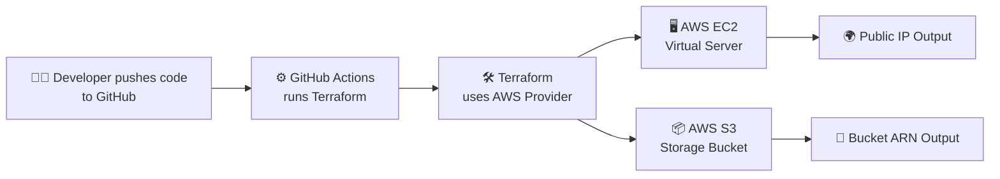

 # 🚀 Terraform Complete Guide – EC2 + S3 Modules

This repository explains **Terraform file structure** in a clear, beginner-friendly way,  
with examples of **EC2 & S3 modules**, visual diagrams, and real usage.  

---


# 🧩 Core Tools & Workflow

## 🔑 Tools We Use

| Terraform | AWS EC2 | AWS S3 | GitHub Actions |
|-----------|---------|--------|----------------|
## 🖼️ Core Tools We Use

| Terraform | AWS EC2 | AWS S3 | GitHub Actions |
|-----------|---------|--------|----------------|
| <br>**Terraform**<br><small>Infrastructure as Code (IaC)</small> | <br>**EC2**<br><small>Virtual servers (compute)</small> | <br>**S3**<br><small>Object storage</small> | <br>**GitHub Actions**<br><small>CI/CD automation</small> |


---

## ⚙️ Step-by-Step Flow

| Step | Tool | What Happens |
|------|------|--------------|
| 1️⃣ | <br>**GitHub Repo** | Stores Terraform code & tracks changes |
| 2️⃣ | <br>**GitHub Actions** | Runs Terraform plan/apply automatically |
| 3️⃣ | <br>**Terraform** | Talks to AWS Provider (API) |
| 4️⃣ | <br>**EC2 Instance** | Creates VM with Public IP |
| 5️⃣ | <br>**S3 Bucket** | Creates bucket for storage & Terraform state |


---

## 🏗️ Visual Workflow (Diagram)



## 🌍 Typical Terraform Project File Structure

terraform-project/
│
├── 📜 main.tf # Main infra code

├── 📜 variables.tf # Input variables

├── 📜 outputs.tf # Outputs

├── 📜 provider.tf # Provider config

├── 📜 versions.tf # Terraform + provider versions

├── 📜 terraform.tfvars # Default variable values

│
├── 📂 modules/ # Reusable modules
│
├── 📂 ec2/
│ │
├── 📜 main.tf
│ │ ├── 📜 variables.tf
│ │ └── 📜 outputs.tf

│ └── 📂 s3/
│ 
├── 📜 main.tf
│ ├── 📜 variables.tf
│ └── 📜 outputs.tf

│
├── 📂 env/
│ ├── 🟢 dev.tfvars
│ ├── 🟡 staging.tfvars
│ └── 🔴 prod.tfvars

│
└── 📂 .terraform/
├── 📜 terraform.tfstate
└── 📜 terraform.tfstate.backup


---

## 📂 Explanation of Each File/Folder

- **main.tf** → Core infrastructure code  
- **variables.tf** → Input variables  
- **outputs.tf** → Output values  
- **provider.tf** → Cloud provider setup  
- **versions.tf** → Terraform + provider versions  
- **terraform.tfvars** → Default values for variables  
- **.terraform/** → Auto-generated folder where providers/modules are stored  
- **terraform.tfstate** → Current infra state (⚠️ don’t edit manually)  
- **terraform.tfstate.backup** → Previous state backup  
- **modules/** → Reusable blocks (EC2, S3, etc.)  
- **env/** → Environment-specific configs (dev, staging, prod)  

---

## 🎯 Quick Mnemonic (to memorize)

- **main.tf** → Main brain 🧠  
- **variables.tf** → Inputs 🎛️  
- **outputs.tf** → Results 📤  
- **provider.tf** → Cloud gate ☁️  
- **versions.tf** → Lock & key 🔑  
- **terraform.tfvars** → Default bag 🎒  
- **modules/** → Lego blocks 🧩  
- **env/** → Dev/Staging/Prod worlds 🌍  
- **.terraform/** → Terraform’s memory 💾  

---

## ⚡ EC2 Module (modules/ec2)

**main.tf**
```hcl
resource "aws_instance" "this" {
  ami           = var.ami_id
  instance_type = var.instance_type
  key_name      = var.key_name

  tags = {
    Name = var.instance_name
  }
}
```

variables.tf
```
variable "ami_id" {
  description = "AMI ID for EC2 instance"
  type        = string
}

variable "instance_type" {
  description = "EC2 instance type"
  type        = string
  default     = "t2.micro"
}

variable "key_name" {
  description = "Key pair name for SSH access"
  type        = string
}

variable "instance_name" {
  description = "Tag name for the instance"
  type        = string
}
```

outputs.tf
```
output "instance_id" {
  value = aws_instance.this.id
}

output "public_ip" {
  value = aws_instance.this.public_ip
}
```

⚡ S3 Module (modules/s3)

main.tf
```
resource "aws_s3_bucket" "this" {
  bucket = var.bucket_name

  tags = {
    Name = var.bucket_name
  }
}
```
variables.tf
```
variable "bucket_name" {
  description = "The name of the S3 bucket"
  type        = string
}

```
outputs.tf

```
output "bucket_name" {
  value = aws_s3_bucket.this.bucket
}

output "bucket_arn" {
  value = aws_s3_bucket.this.arn
}
```

⚡ Root Module (calls EC2 + S3)

main.tf

```
provider "aws" {
  region = var.aws_region
}

module "ec2_instance" {
  source        = "./modules/ec2"
  ami_id        = var.ami_id
  instance_type = var.instance_type
  key_name      = var.key_name
  instance_name = "My-Terraform-EC2"
}

module "s3_bucket" {
  source      = "./modules/s3"
  bucket_name = var.bucket_name
}
```
variables.tf

```
variable "aws_region" {
  description = "AWS region"
  type        = string
  default     = "us-east-1"
}

variable "ami_id" {
  description = "AMI ID for EC2"
  type        = string
}

variable "instance_type" {
  description = "EC2 instance type"
  type        = string
  default     = "t2.micro"
}

variable "key_name" {
  description = "Key pair name"
  type        = string
}

variable "bucket_name" {
  description = "S3 bucket name"
  type        = string
}
```
outputs.tf
```
output "ec2_public_ip" {
  value = module.ec2_instance.public_ip
}

output "s3_bucket_arn" {
  value = module.s3_bucket.bucket_arn
}
```
terraform.tfvars (example values)
```
aws_region    = "us-east-1"
ami_id        = "ami-08d4ac5b634553e16" # Example Amazon Linux AMI
instance_type = "t2.micro"
key_name      = "my-keypair"
bucket_name   = "my-terraform-demo-bucket-123"

```
🏗️ Architecture Diagram

Here’s how Terraform provisions resources:      +----------------------+
      |   Terraform CLI      |
      +----------+-----------+
                 |
                 v
       +---------+---------+
       |   AWS Provider    |
       +---------+---------+
                 |
   +-------------+-------------+
   |                           |
   v                           v
+--------+              +---------------+
|  EC2   |              |     S3        |
|Instance|              |   Bucket      |
+--------+              +---------------+
   |                           |
   |--> Public IP              |--> Bucket ARN

▶️ Usage

Initialize Terraform

terraform init

Validate configuration

terraform validate

Plan the changes

terraform plan -var-file="terraform.tfvars"


Apply the configuration

terraform apply -var-file="terraform.tfvars" -auto-approve


Check Outputs

terraform output

📤 Example Output

EC2 Instance Public IP 🌍

S3 Bucket ARN 🔑

🧹 Cleanup

Destroy everything when done:

terraform destroy -var-file="terraform.tfvars" -auto-approve


✅ With this setup, you now have a modular, clean, and reusable Terraform project.
It builds both EC2 and S3 using separate modules.

🤖 CI/CD with GitHub Actions

You can run Terraform automatically with GitHub Actions 🚀

name: Terraform CI/CD

on:
  push:
    branches:
      - main

jobs:
  terraform:
    runs-on: ubuntu-latest
    steps:
      - name: Checkout repo
        uses: actions/checkout@v3

      - name: Setup Terraform
        uses: hashicorp/setup-terraform@v3

      - name: Terraform Init
        run: terraform init

      - name: Terraform Plan
        run: terraform plan -var-file="terraform.tfvars"

      - name: Terraform Apply
        run: terraform apply -var-file="terraform.tfvars" -auto-approve


✅ Now when you push changes → GitHub builds infra for you 🎉
